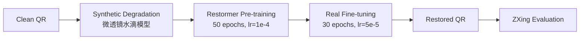

# 基于深度学习的二维码图像恢复系统

A deep learning based QR code restoration framework using Restormer.

## Overview

二维码在实际环境中容易受到水滴、反光、模糊等因素影响，导致扫描失败。

本项目提出了一种基于深度学习的二维码恢复方法，通过轻量 Restormer 网络恢复受损二维码，使用 ZXing 解码成功率作为主要评价指标。

训练采用两阶段策略：

1. **Synthetic Pre-training** — 利用程序生成退化二维码（微透镜模型模拟水滴），学习通用恢复能力。
2. **Real-world Fine-tuning** — 利用真实拍摄数据做域适配，提高实际环境恢复性能。

## Pipeline

```
python pipeline.py
```



也可单独运行：

| 阶段 | 命令 |
|------|------|
| Pretrain | `python pretrain.py` |
| Finetune | `python finetune.py` |
| Pipeline | `python pipeline.py` |

## Method

采用轻量化 Restormer 作为恢复网络。

| 参数 | 设置 |
|------|------|
| Input Channels | 1 |
| Output Channels | 1 |
| Embedding Dim | 24 |
| Transformer Blocks | [2, 2, 2, 3] |
| Attention Heads | [1, 2, 2, 4] |

## Loss

| 损失 | 权重(Pretrain/Ft) | 说明 |
|------|------------------|------|
| L1 Loss | 0.45 / 0.45 | 像素级重建 |
| SSIM Loss | 0.15 / 0.15 | 结构相似性 |
| ROI L1 | 0.20 / 0.20 | 受损区域加权 |
| Edge Loss | 0.10 / 0.10 | 边缘保持 |
| FFT Loss | 0.10 / 0.15 | 频域结构恢复 |
| Soft Dice | 0.10 / 0.10 | 暗区重建 |
| Binary Loss | 0.05 / 0.05 | 二值化先验 |
| ZXing Proxy | 0.05 / 0.05 | 可微解码指导 |

## Dataset

### Synthetic（Pretrain）

| 集合 | 数量 | 说明 |
|------|------|------|
| Train | 15000 | 在线退化生成 |
| Val | 1875 | 固定配对数据 |

### Real（Finetune）

| 集合 | 数量 | 说明 |
|------|------|------|
| Train | 6480 | 真实手机拍摄 input/target 配对 |
| Val | 810 | 固定配对数据 |

## Results

| Dataset | ZXing Success Rate |
|---------|--------------------|
| Synthetic Test | TBD |
| Real Test | TBD |

## Requirements

```bash
conda create -n qrwater python=3.10
conda activate qrwater
pip install -r requirements.txt
```

## Structure

```
QRWaterRemoval/
├── builders/                 # 模型/优化器/会话构建
│   ├── model.py              #   构建 Restormer
│   ├── optimizer.py          #   构建优化器 + WarmupCosineLR
│   ├── resume.py             #   断点续训 & 预训练权重加载
│   └── session.py            #   训练会话 & 日志构建
│
├── configs/                  # 实验超参配置
│   ├── base.py               #   基础配置（模型维度、优化器默认值）
│   ├── pretrain.py           #   预训练配置（50 epoch, lr=1e-4）
│   └── finetune.py           #   微调配置（30 epoch, lr=5e-5）
│
├── datasets/                 # 数据加载
│   ├── base_dataset.py       #   基类（read_img, preprocess, 几何增强）
│   ├── synthetic_dataset.py  #   合成数据集（在线退化）
│   ├── paired_dataset.py     #   真实配对数据集（Finetune val/test）
│   ├── mixed_dataset.py      #   混合数据集（真实 + 合成，Finetune train）
│   └── builder.py            #   DataLoader 工厂
│
├── engine/                   # 训练引擎
│   ├── experiment.py         #   实验入口（seed, 构建, 运行, 测试）
│   ├── trainer.py            #   单步训练（AMP + grad clip）
│   ├── train_loop.py         #   训练循环（epoch 级别）
│   ├── evaluator.py          #   验证/测试（loss + metrics + visual）
│   ├── session.py            #   训练会话管理
│   ├── checkpoint.py         #   模型保存 & 加载
│   ├── earlystop.py          #   早停策略
│   └── metrics.py            #   指标汇总（PSNR, SSIM, BinaryAcc, ZXing）
│
├── models/                   # 模型定义
│   └── restormer.py          #   Restormer 实现
│
├── utils/                    # 工具模块
│   ├── degradation.py        #   水滴退化（微透镜物理模型）
│   ├── metrics.py            #   指标计算（PSNR, SSIM, ZXing 解码率）
│   ├── visualizer.py         #   可视化输出
│   ├── train_logger.py       #   训练日志（CSV）
│   └── ema.py                #   指数移动平均
│
├── preCode/                  # 数据集预处理脚本
│   ├── generate_qr.py        #   生成干净二维码
│   ├── add_waterdrop.py      #   给二维码加水滴
│   ├── split.py / split_pair.py   #   数据集划分
│   └── rename.py / resize / ...
│
├── pretrain.py               # 预训练入口
├── finetune.py               # 微调入口
├── pipeline.py               # Pretrain → Finetune 一键流水线
├── loss.py                   # 损失函数（8 种组合）
├── requirements.txt          # Python 依赖
├── README.md
│
├── data/                     # 原始数据
├── checkpoints/              # 模型检查点
└── logs/                     # 训练日志（CSV）
```
