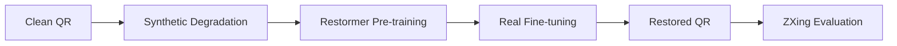

# 基于深度学习的二维码图像恢复系统

A deep learning based QR code restoration framework using Restormer.

## Overview

二维码在实际环境中容易受到水滴、反光、模糊等因素影响，导致扫描失败。

本项目提出了一种基于深度学习的二维码恢复方法，通过 Restormer 网络恢复受损二维码，并使用 ZXing 解码成功率作为主要评价指标。

训练采用两阶段策略：

1. Synthetic Pre-training:
   利用程序生成退化二维码学习通用恢复能力。

2. Real-world Fine-tuning:
   利用真实拍摄数据进行域适配，提高实际环境下的恢复性能。

## Pipeline



## Method

采用轻量化 Restormer 作为恢复网络。

| 参数                | 设置      |
| ------------------- | --------- |
| Input Channels      | 1         |
| Output Channels     | 1         |
| Embedding Dimension | 24        |
| Transformer Blocks  | [2,2,2,3] |
| Attention Heads     | [1,2,2,4] |

Input: 

- Damaged QR image 

Output: 

- Restored QR image

### Loss

训练目标由多个损失组成：

- L1 Loss
- SSIM Loss
- Edge Loss
- Binary Prior Loss
- ZXing Proxy Loss

## Dataset

### Synthetic Dataset

由干净二维码在线生成退化样本。

包含：

- Water Drop
- Blur
- Reflection
- Noise


### Real Dataset

真实手机拍摄二维码数据，用于 Fine-tuning。

## Results


| Dataset        | ZXing Success Rate |
| -------------- | ------------------ |
| Synthetic Test | 98.48%             |
| Real Test      | TBD                |

## Usage

### Pre-training

python pretrain.py


### Fine-tuning

python finetune.py

### Pipeline

python pipeline.py (use best-zxing.pth)


### Testing

python test.py

## Structure

```
QR-Restoration
│
├── model
├── tool
├── datasets
├── checkpoints
├── pretrain.py
├── finetune.py
├── pipeline.py
└── test.py
```
